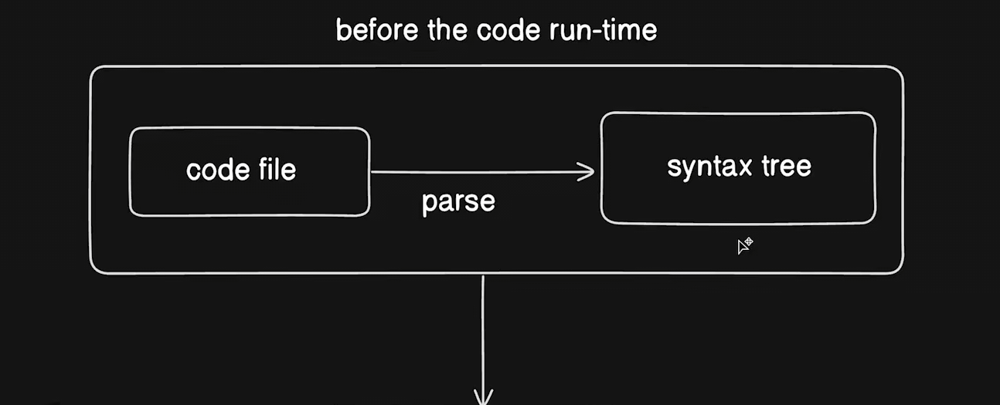
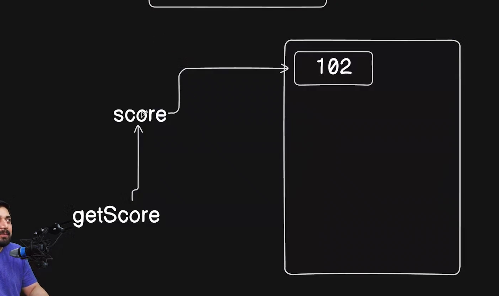

# What is javascript

1. JavaScript is a versatile, high-level programming language primarily used for creating interactive and dynamic content on websites.
2. It is a core technology of the World Wide Web, alongside HTML and CSS.
3. JavaScript enables developers to implement complex features such as interactive forms, animations, and real-time updates without requiring a page reload.
4. It is an essential skill for front-end development and is also widely used on the server-side with environments like Node.js.

# JavaScript code is executed in the following steps:

1. **Parsing**: The JavaScript engine parses the code, converting it into an Abstract Syntax Tree (AST).
2. **Compilation**: The AST is then compiled into bytecode or machine code by the Just-In-Time (JIT) compiler.
3. **Execution**: The compiled code is executed by the JavaScript engine, which interprets and runs the code on the browser or server.

In a browser environment, JavaScript code is executed by the browser's JavaScript engine (e.g., V8 in Chrome, SpiderMonkey in Firefox). The engine reads the code, compiles it, and executes it, allowing for dynamic interactions on the web page.

In a server-side environment like Node.js, the V8 engine is used to execute JavaScript code on the server, enabling server-side scripting and building scalable network applications.




# Different printing methods in JavaScript

1. **console.log()**: Used to print messages to the web console. Commonly used for debugging purposes.

   ```javascript
   console.log("Hello, World!");
   ```

2. **document.write()**: Writes directly to the HTML document. It is rarely used in modern web development.

   ```javascript
   document.write("Hello, World!");
   ```

3. **alert()**: Displays an alert dialog with the specified message and an OK button.

   ```javascript
   alert("Hello, World!");
   ```

4. **innerHTML**: Sets or returns the HTML content of an element.

   ```javascript
   document.getElementById("myElement").innerHTML = "Hello, World!";
   ```

5. **console.error()**: Outputs an error message to the web console.

   ```javascript
   console.error("This is an error message");
   ```

6. **console.warn()**: Outputs a warning message to the web console.

   ```javascript
   console.warn("This is a warning message");
   ```

7. **console.table()**: Displays tabular data as a table in the web console.
   ```javascript
   console.table([
     { name: "John", age: 30 },
     { name: "Jane", age: 25 },
   ]);
   ```


# Data Types


JavaScript has a variety of data types that are essential for understanding how to work with variables and data manipulation. Below are the key points to remember about JavaScript data types:

## 1. Primitive Data Types
Primitive data types are the most basic data types in JavaScript. They are immutable and represent a single value.

### a. Number
- Represents both integer and floating-point numbers.
- Example: 
  ```javascript
  let age = 25; // integer
  let price = 19.99; // floating-point
  ```

### b. String
- Represents a sequence of characters.
- Strings can be defined using single quotes, double quotes, or backticks (template literals).
- Example:
  ```javascript
  let name = "John Doe";
  let greeting = `Hello, ${name}!`;
  ```

### c. Boolean
- Represents a logical entity and can have two values: `true` or `false`.
- Example:
  ```javascript
  let isActive = true;
  ```

### d. Undefined
- A variable that has been declared but has not yet been assigned a value is of type `undefined`.
- Example:
  ```javascript
  let notAssigned;
  console.log(notAssigned); // undefined
  ```

### e. Null
- Represents the intentional absence of any object value.
- Example:
  ```javascript
  let emptyValue = null;
  ```

### f. Symbol (ES6)
- A unique and immutable primitive value, often used as object property keys.
- Example:
  ```javascript
  const uniqueId = Symbol('id');
  ```

### g. BigInt (ES11)
- A numeric type that can represent integers with arbitrary precision.
- Example:
  ```javascript
  const bigNumber = BigInt(123456789012345678901234567890);
  ```

## 2. Reference Data Types
Reference data types are more complex and can hold collections of values or more complex entities.

### a. Object
- A collection of key-value pairs.
- Example:
  ```javascript
  let person = {
    name: "Alice",
    age: 30,
    isEmployed: true
  };
  ```

### b. Array
- A special type of object used to store ordered collections.
- Example:
  ```javascript
  let fruits = ["apple", "banana", "cherry"];
  ```

### c. Function
- Functions in JavaScript are first-class objects and can be assigned to variables, passed as arguments, or returned from other functions.
- Example:
  ```javascript
  function greet() {
    return "Hello!";
  }
  ```

## 3. Type Checking
- Use `typeof` operator to check the type of a variable.
- Example:
  ```javascript
  console.log(typeof age); // "number"
  console.log(typeof name); // "string"
  ```

## 4. Type Coercion
- JavaScript performs automatic type conversion in certain situations, which can lead to unexpected results.
- Example:
  ```javascript
  console.log("5" + 5); // "55" (string concatenation)
  console.log("5" - 5); // 0 (numeric subtraction)
  ```


