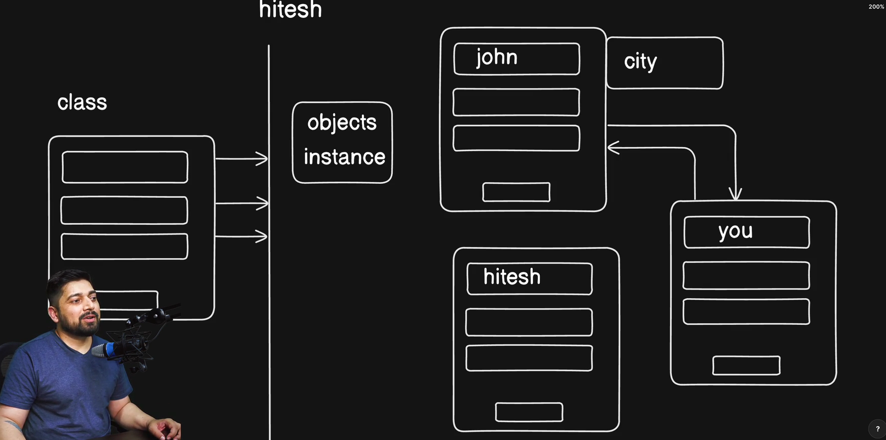
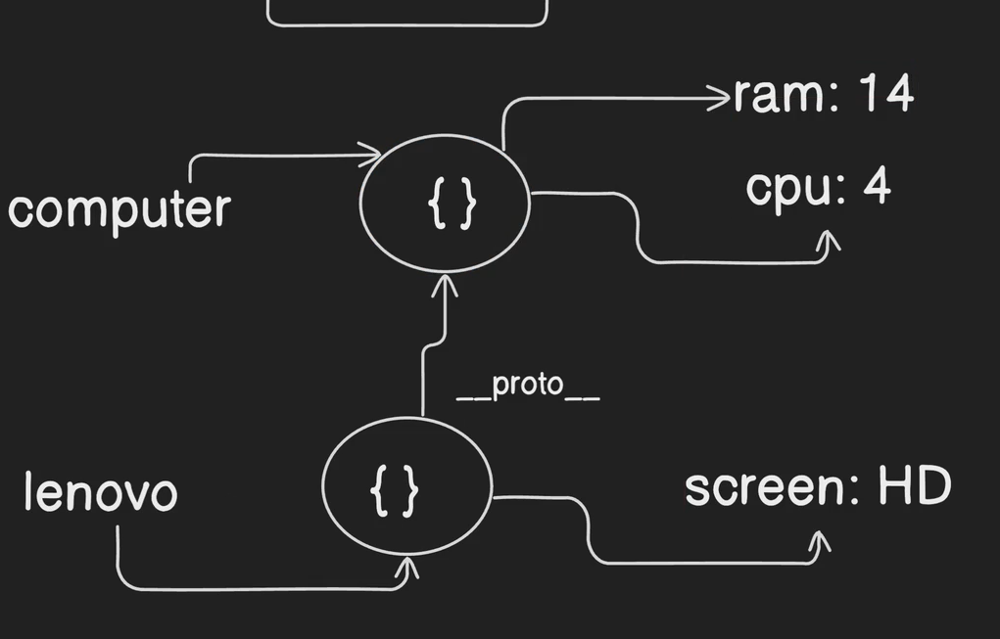

# Paradims of Progamming
javascript is a still prototype-based language, but it has borrowed many features from other programming paradigms. 
 # Does javascript is an object-oriented programming language?
 Yes, JavaScript is an object-oriented programming (OOP) language. It uses a prototype-based model, but also has a class syntax that allows for typical OOP practices. 

 # OOPS
 

# prototype-based programming
JavaScript is a prototype-based language, which means that objects can inherit properties directly from other objects. This is different from class-based languages, where objects inherit properties from classes.
prototype means extra properties and functionalities in any given datatype.

```javascript
let computer = { cpu: 12 };
let lenovo = {
  screen: "HD",
  __proto__: computer,
};
let tomHardware = {};

console.log(`lenovo`, computer.__proto__);

```
